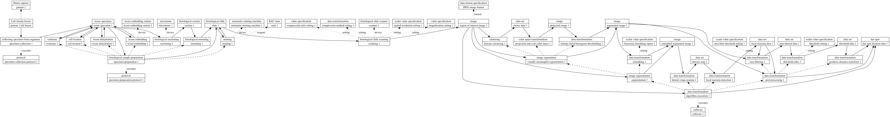

# QHIO Hot Spot Example

This document shows how QHIO and other Open Biomedical Ontologies can be used to make statements about a particular histopathology assay, its inputs, and its results. The example is fictional, but shows that the breadth and depth of detail that this approach enables, as we trace a path from the patient to a set of hot spot locations. This level of detail is not always necessary, but serves as a good demonstration and test case. Figure 1 summarizes the statements.

Figure 1 ([PDF](https://github.com/ontodev/QHIO/raw/master/example.pdf)): Each box represents a particular, with its name below and the name of the universal that it instantiates above. Solid lines indicate the flow of input to output. Dashed lines indicate parthood. Dotted lines with labels are used for all other relations.

## Using this Document

Indented code blocks contain the statements under discussion. The statements are grouped into "stanzas", starting with the name of the thing under discussion, followed by indented lines with the names of predicates and their values. The structure is similar to [Turtle syntax](http://www.w3.org/TR/turtle/), except that labels are used instead of IRIs. This format can be converted to Turtle and other linked data formats by adding mappings from labels to IRIs, and it was automatically rendered into the diagram above.

We carefully distinguish between universals and particulars. Universals do not exist in time and space; they are instantiated by particulars that exist in time and space. When we want to say what type of thing a particular is, we refer to a universal, using a term from one of our reference ontologies. We adopt the convention of adding a number to the names for particulars, emphasizing that "slide 1" is just one particular instance of the universal [microscrope slide](http://purl.obolibrary.org/obo/OBI_0400170).

We are describing two main sorts of things: particular processes that took place at some time, and the particular things that were the inputs and outputs of those processes. In the first few stages the inputs and outputs are material things. Then an image is created, with a material thing as input and information as output. Subsequently the inputs and outputs are information content entities.

We abbreviate some of the labels for relations, and use some other short-hand that can be expanded to more complex OWL class expressions:

- [type](http://www.w3.org/1999/02/22-rdf-syntax-ns#type)
- [part of](http://purl.obolibrary.org/obo/BFO_0000050)
- [has part](http://purl.obolibrary.org/obo/BFO_0000051)
- input: [has specified input](http://purl.obolibrary.org/obo/OBI_0000293)
- output: [has specified output](http://purl.obolibrary.org/obo/OBI_0000299)
- value: [has specified value](http://purl.obolibrary.org/obo/OBI_0001937)
- device: [has participant](http://purl.obolibrary.org/obo/RO_0000057) some [device](http://purl.obolibrary.org/obo/OBI_0000968) X
- reagent: [has participant](http://purl.obolibrary.org/obo/RO_0000057) some [reagent](http://purl.obolibrary.org/obo/OBI_0001879) X
- executes: [realizes](http://purl.obolibrary.org/obo/BFO_0000055) some ([concretizes](http://purl.obolibrary.org/obo/RO_0000059) some X)
- setting: device was used with a particular setting
- format: [information content entity](http://purl.obolibrary.org/obo/IAO_0000030) has a particular [data format specification](http://purl.obolibrary.org/obo/IAO_0000098)

TODO: Settings need more work.

## Tissue Collection

The first stage is to collect tissue from the patient. We focus on OBI's [collecting specimen from organism](http://purl.obolibrary.org/obo/OBI_0600005) process, with the patient as input and a [tissue specimen](http://purl.obolibrary.org/obo/OBI_0001479) as output. We also specify a protocol for the collection, but do not say more about it. More detail can easily be added to this stage using existing OBI terms, such as the people involved in this process and their roles.

    patient 1
      type: Homo sapiens

    patient 1 left breast
      type: Left female breast
      part of: patient 1

    specimen collection protocol 1
      type: protocol

    specimen collection 1
      type: collecting specimen from organism
      executes: specimen collection protocol 1
      input: patient 1 left breast
      output: tissue specimen 1

    tissue specimen 1
      type: tissue specimen

We may want to be more specific about the target of the specimen collection. If we know at this point that there is a [ductal carcinoma in situ](http://purl.obolibrary.org/obo/DOID_0060074), then it can be the target. If all we know at this point is that there is a "mass", then we have to make a statement that expresses what we know to be true without saying anything more.

## Tissue Preparation

The second stage is the transformation of the tissue specimen into a slide for scanning. We focus on the existing [histological sample preparation](http://purl.obolibrary.org/obo/OBI_0000341) process, but also specify a number of parts of this process, most of which are not yet defined in any of our source ontologies.

    specimen preparation protocol 1
      type: protocol

    specimen preparation 1
      type: histological sample preparation
      executes: specimen preparation protocol 1
      input: tissue specimen 1
      has part: cell fixation 1
      has part: ischemia 1
      has part: tissue dehydration 1
      has part: tissue embedding 1
      has part: staining 1
      output: slide 1

Unlike the rows and columns of a table, the graph data structures used in linked data do not have a natural order. To capture the order of these processes we must be explicit. When the output of one process is the input to the next process then we can infer the order, otherwise we specify a `preceded by` relation from the later process to the earlier one. We specify devices and reagents for some of the processes.

    cell fixation 1
      type: cell fixation
      input: tissue specimen 1
      output: tissue specimen 1

    ischemia 1
      type: ischemia
      preceded by: cell fixation 1
      input: tissue specimen 1
      output: tissue specimen 1

    tissue dehydration 1
      type: tissue dehydration
      preceded by: ischemia 1
      input: tissue specimen 1
      output: tissue specimen 1

    tissue embedding station 1
      type: tissue embedding station

    tissue embedding 1
      type: tissue embedding
      preceded by: tissue dehydration 1
      device: tissue embedding station 1
      input: tissue specimen 1
      output: slide 1

    automatic staining machine 1
      type: automatic staining machine

    stain 1
      type: Ki-67 stain

    staining 1
      type: staining
      preceded by: tissue embedding 1
      device: automatic staining machine 1
      reagent: stain 1
      input: slide 1
      output: slide 1

    slide 1
      type: microscope slide
      comment: The particular slide that was scanned to create the input image.

Other data may be important:

- the technicians performing these tasks

## Imaging

In the third stage we move from the physical slide to information about the slide. The focus is the [image creation](http://purl.obolibrary.org/obo/OBI_0001007) process, with the slide as input and an image as output.

NOTE: OME encodes all sorts of information about the scanners and other devices.

NOTE: You select part of the slide to scan from the glass slide, then maybe select a subset of that image for processing. So can be two senses of “region of interest”.

    scanner 1
      type: whole slide scanner
      comment: Aperio brand slide scanner.

    scanning 1
      type: image creation
      device: scanner 1
      setting: resolution setting 1
      setting: image compression setting 1
      input: slide 1
      output: region of interest image 1

    resolution setting 1
      type: scalar value specification
      value: 40

    image compression setting 1
      type: scalar value specification
      value: 0.7

    JPEG image format
      type: data format specification

    region of interest image 1
      type: image
      format: JPEG image format
      comment: A subset of the original whole slide image, maybe 1000x2000 pixels.

Given an image, we want to be able to retrieve important information about it. We can do so by querying over one or more links:

- scanned from: ?image output of ?scanning has input ?slide
- scanned by: ?image output of ?scanning has device ?scanner
- scanned at: ?image output of ?scanning has setting ?resolution has value ?value

## Algorithm Execution

In the fourth stage we transform the image data using software that implements several algorithms. We use the general OBI term [data transformation](http://purl.obolibrary.org/obo/OBI_0200000), describing the main process and several process parts, with the following structure:

- algorithm execution
    - segmentation
        - visually meaningful segmentation
            - kmeans clustering
            - projection into Lab color space
            - entropy based histogram thresholding
        - smoothing
    - density map creation
    - local maxima detection
    - post processing
        - area filtering
        - threshold rules
        - geodesic distance transform

TODO: Be more specific about the types of these data transformations.

The data transformations execute [algorithms](http://purl.obolibrary.org/obo/IAO_0000064), which are encoded in [software](http://purl.obolibrary.org/obo/IAO_0000010). There are subtle distinctions here that need more work.

    software 1
      type: software

    algorithm execution 1
      type: data transformation
      comment: The particular process in which the software that implements the algorithm is executed. This occurs at a particular time and place.
      executes: software 1
      input: region of interest image 1
      has part: segmentation 1
      has part: density map creation 1
      has part: local maxima detection 1
      has part: post processing 1
      output: hot spot location data 1

    segmentation 1
      type: data transformation
      comment: The particular process in which the Visually Meaningful Segmentation algorithm was executed on a particular image.
      input: region of interest image 1
      has part: visually meaningful segmentation 1
      has part: smoothing 1
      output: smoothed segmented image 1

    visually meaningful segmentation 1
      type: data transformation
      input: region of interest image 1
      has part: kmeans clustering 1
      has part: projection into Lab color space 1
      has part: entropy based histogram thresholding 1
      output: segmented image 1

    kmeans clustering 1
      type: data transformation
      input: region of interest image 1
      output: cluster data 1

    cluster data 1
      type: data set

    projection into Lab color space 1
      type: data transformation
      preceded by: kmeans clustering 1
      input: cluster data 1
      output: projected image 1

    projected image 1
      type: image

    entropy based histogram thresholding 1
      type: data transformation
      preceded by: projection into Lab color space 1
      input: projected image 1
      output: segmented image 1

    segmented image 1
      type: image

    smoothing 1
      type: data transformation
      preceded by: visually meaningful segmentation 1
      setting: Gaussian smoothing sigma 1
      input: segmented image 1
      output: smoothed segmented image 1

    Gaussian smoothing sigma 1
      type: scalar value specification
      value: 1

    smoothed segmented image 1
      type: image

    density map creation 1
      type: data transformation
      preceded by: segmentation 1
      input: smoothed segmented image 1
      output: density map 1

    density map 1
      type: data set

    local maxima detection 1
      type: data transformation
      preceded by: density map creation 1
      input: density map 1
      output: local maxima data 1

    local maxima data 1
      type: data set

    post processing 1
      type: data transformation
      preceded by: local maxima detection 1
      input: segmented image 1
      input: local maxima data 1
      has part: area filtering 1
      has part: threshold rules 1
      has part: geodesic distance transform 1
      output: hot spot location data 1

    area filtering 1
      type: data transformation
      setting: area filter threshold setting 1
      input: segmented image 1
      input: local maxima data 1
      output: area filtered data 1

    area filter threshold setting 1
      type: scalar value specification
      value: 530

    area filtered data 1
      type: data set

    threshold rules 1
      type: data transformation
      setting: threshold setting 1
      input: area filtered data 1
      output: threshold data 1

    threshold setting 1
      type: scalar value specification
      value: 0.15

    threshold data 1
      type: data set

    geodesic distance transform 1
      type: data transformation
      input: threshold data 1
      output: hot spot location data 1

    hot spot location data 1
      type: data set
      annotation of: region of interest image 1
      is about: tissue specimen 1

## Hot Spots

The result of all this work is a data set describing the locations of hot spots within the image. These are polygons within the image’s coordinate system that indicate the boundaries of the hot spots.

Once hot spots have been found, we can (carefully) connect the data back to the patient.

